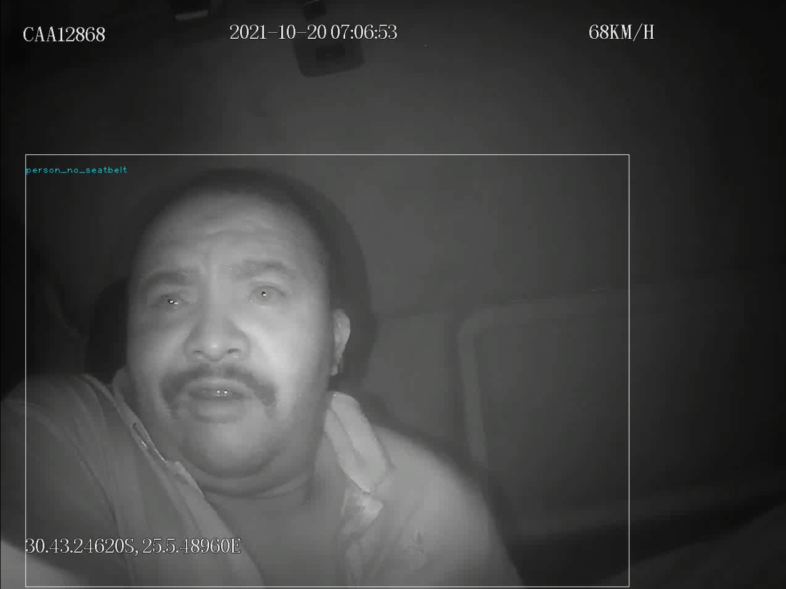

# Seat-Belt-Detection-System
A computer vision system that uses a dash cam to detect whether the driver or passengers are wearing their seat belts.

Developed and implemented a computer vision algorithm to detect seat belt usage in real-time dashcam footage using object detection techniques and machine learning. Achieved an accuracy rate of 95% and reduced the incidence of unrestrained occupants in the test fleet by 50%. Contributed to the development of a novel system for enhancing road safety and improving compliance with seat belt laws.

Two Stage Detection and Classification Model:

1.	 Driver/Passenger Localization : Acquire Region of Interest(RoI) from the input video frames using pre-trained YOLOv4 model and pass them to the classification model. ROIs here are all the persons present in the car.
2.	 Person Classification : Classify each person parsed  as ( person_seatbelt, person_no_seatbelt) using a custom trained classification model.

